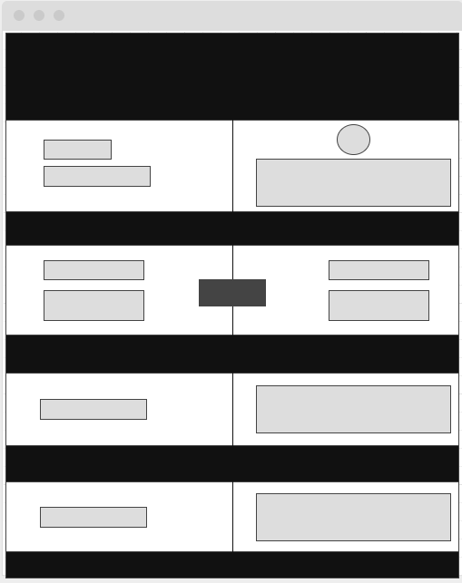

# Spyglass 

## Description
This app is for the traveler with an itch, but not quite sure how to scratch it. They need to go somewhere, just not sure where. Maybe it's a vacation to be booked for later in the year, or maybe its for a quick spur of the moment adventure. This app offers users the optiont to select from a list of countries and get back helpful info that could pursuade them to go or not to go. They will get info about a country like the currency name, symbol, and conversion rate, the language spoken there, the capitol city, and the population. Additionally, for a user who is planning financially, there is a currency converter that allows them to convert from any currency to any currency based on a given amount, which can be helpful when planning a budget. 


## User Story

```
AS A person interested in traveling
I WANT be able to look up different countries and know a little bit about them and what my travel budget is worth in that country 
SO THAT I can plan a financially sound and enjoyable trip 
```
## Wireframe

## APIs
### Rest Countries API
https://restcountries.eu/#api-endpoints-language

### Currency Converter API
https://currency.getgeoapi.com/

## Rough Breakdown of Tasks
General front end layout - Jacqueline
Rest Countries API calls and script - Gabriel
Get Geo API curerncy converter calls and script - Greg 
Powerpoint for presentation - Alain

## Future Developments 
Provide condiditonal information about the countries (food, major attrations, other relevnat info)
Random swipe option for places they like or dont like and stores 
Search parameters so that people can search based on experience rather than just country name 


