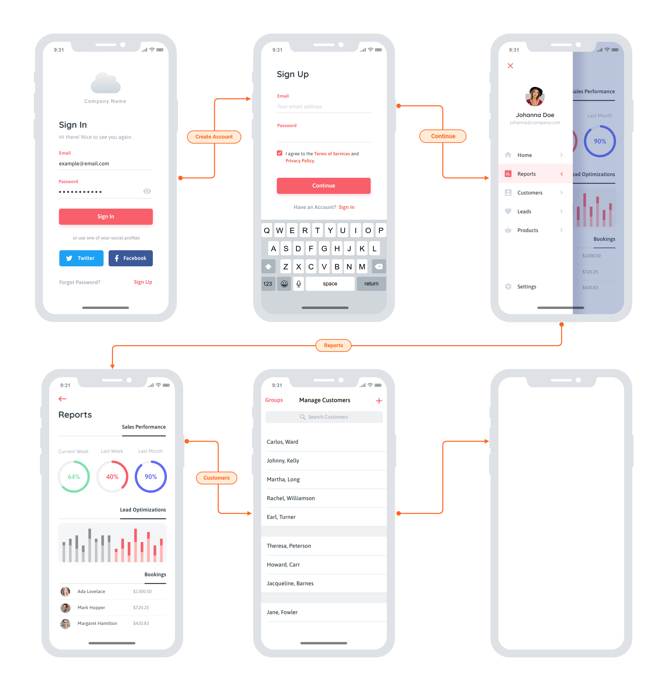

# Project Proposal 

## Title - Carbon Control 

## Description
This application will allow a user to compare their carbon footprint to a standard based on various sustainability criteria. 


## User Story

```
AS A environmentally conscious citizen of earth 
I WANT know my individual impact on climate change specically with regards to carbon footprint
SO THAT I can minimize my own carbonfootprint and encourage others to do the same 
```
## Wireframe

## APIs
### Cool Climate Calculator API
https://coolclimate.org/api 

### Air Quality API
https://www.iqair.com/air-pollution-data-api

## Rough Breakdown of Tasks
determine the types of code to be used (Jquery, CSS frameworks)
what parameters we want the application to focus on/get from the user
determine all the features (storing user input with their login credentials, challenge of the day, etc.)
research the functionality and limits of the APIs
find other userful APIs based on features of the application (NY Times?)
Finalize the wireframe 


